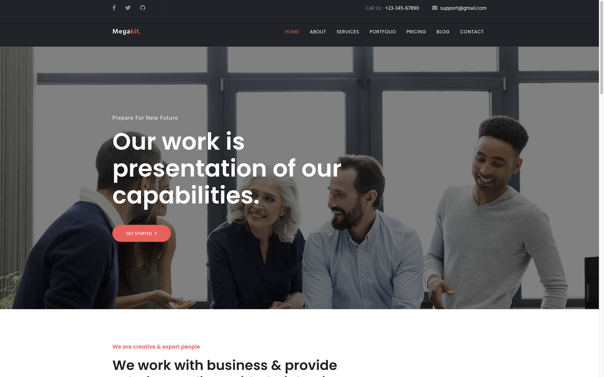

# Megakit

Business template for Hugo. Browse through a [live demo](https://timely-land.cloudvent.net/). This theme has been adapted from the MIT licensed [Megakit Bootstrap template from Theme Fisher](https://github.com/themefisher/Megakit-Bootstrap-Agency-Template).

Megakit was made by [Themefisher](https://themefisher.com/) and converted to Hugo by [CloudCannon](https://cloudcannon.com/), a Jamstack platform for the whole team.

## Features

* Contact form
* Pre-built pages
* Pre-styled components
* Blog with pagination and category pages
* Configurable footer
* Optimised for editing in [CloudCannon](https://cloudcannon.com/)

## Setup

Get a workflow going to see your site's output (with [CloudCannon](https://app.cloudcannon.com/) or Hugo locally).

## Develop

Megakit was built with [Hugo](https://gohugo.io/) version `0.87.0`, but should support newer versions as well.

Run the standalone executable `hugo` to serve the site locally:

~~~bash
$ hugo server
~~~

## Editing

Megakit is set up for adding, updating and removing pages, components, posts, company details and footer elements in [CloudCannon](https://app.cloudcannon.com/).

### Company details

* Reused around the site to save multiple editing locations.
* Set in the *Data* / *Company* section.
